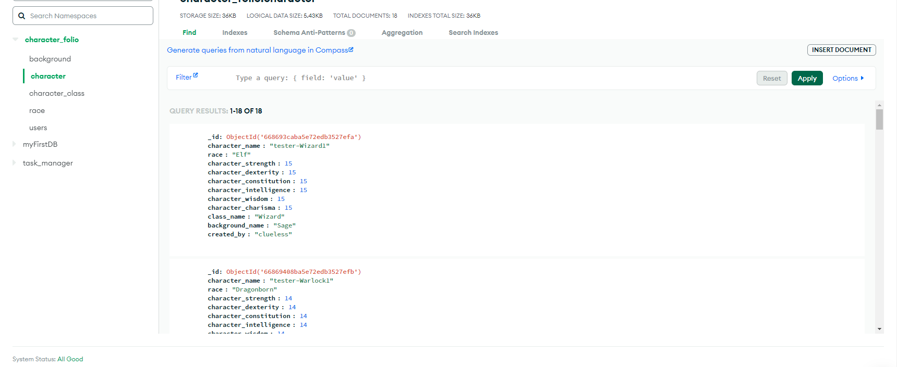
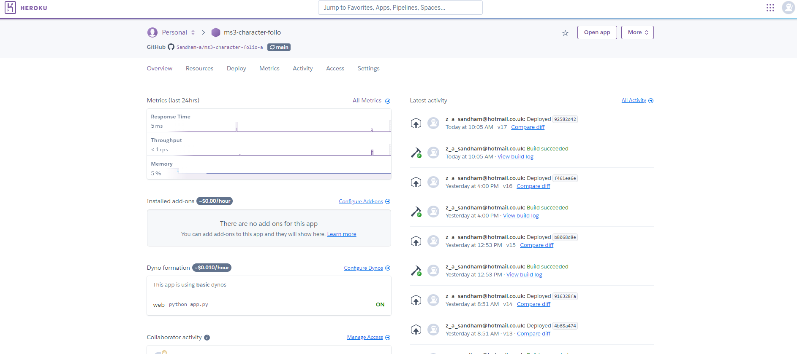
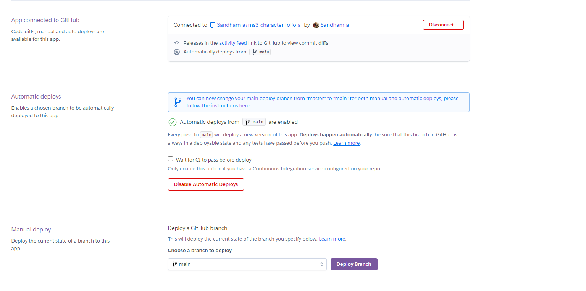

# Character Folio
(Developer: Adam Sandham)


[Live webpage](https://github.com/Sandham-a/ms3-character-folio)

## Table of Content

1. [Project Goals](#project-goals)
    1. [User Goals](#user-goals)
    2. [Site Owner Goals](#site-owner-goals)
2. [User Experience](#user-experience)
    1. [Target Audience](#target-audience)
    2. [User Requirements and Expectations](#user-requirements-and-expectations)
    3. [User Stories](#user-stories)
    4. [Site Owner Stories](#site-owner-stories)
3. [Design](#design)
    1. [Design Choices](#design-choices)
    2. [Colour](#colours)
    3. [Fonts](#fonts)
    4. [Structure](#structure)
    5. [Wireframes](#wireframes)
4. [Technologies Used](#technologies-used)
    1. [Languages](#languages)
    2. [Frameworks & Tools](#frameworks-&-tools)
5. [Features](#features)
6. [Testing](#validation)
    1. [Device testing](#performing-tests-on-various-devices)
    2. [Testing user stories](#testing-user-stories)
8. [Bugs](#Bugs)
9. [Deployment](#deployment)
10. [Credits](#credits)
11. [Acknowledgments](#acknowledgments)

## Project Goals 
The aim of this project is to showcase python and flask development in relation to web application development.

### User Goals
- To create/view/delete/ edit basic Dungeon and Dragons (DnD) character templates.
- To view a catalogue of characters that have been developed by the rest of the users on the site. 

### Site Owner Goals
- Creating an engaging site that allows people the create characters for their DnD games.
- Create a system that talks to mongoDB and stores the information in a non relational database and is able to retrieve and edit information when needed

## User Experience

### Target Audience
- DnD players looking for somewhere to store their character ideas
- Dungeon Masters that are looking for inspiration in regards to characters to use in their campaigns.   

### User Requirements and Expectations
- A simple and intuitive site to navigate.
- A site that allows users to an account and password.
- A site secure enough that allows only them to delete and and edit their characters.
- Functions and Links work as expected.
- A website that looks like it was produced professionally.
- An easy way to leave feedback.
- Accessibility.

### User Stories
1. As a user, I want to be able to create a DnD character and have it stored.
2. As a user, I wish to be able to access any character I create at a later date.
3. As a user, I wish to be able to edit any character I create and be able to update the information. 
4. As a user, I wish to be able to delete any character I create as if I no longer need it.
5. As a user, I wish to know that the system is secure that only I can edit or delete characters that I've created.

### Site Owner Stories
6. As a site owner, I want users to be able to contact us for suggestions about how to improve the game.
7. As a site owner, I want users to be able to find us on social media.

## Design

### Design Choices
The site was designed to highlight the medieval themes whilst also giving a clean and professional display 

### Colour
The colors where selected as part of the materialize blue-grey color scheme with a contrast of an off white to allow for good contrast and readability.  

### Fonts
The font for the title was Ruthie as it has the balance of being a handwriting script whilst also being amongst the more legible scripts available as part of google fonts

### Structure
The site will be based on the having one page running each of the basic database functions withing a base webpage. 

### Wireframes

- Due to the way the game is laid out it is not necessary to alter the design layout for desktop and table and only minor alteration will need to be made for mobile screens

<details><summary>Login Screen</summary>

</details>
<details><summary>Profile</summary>

</details>
<details><summary>New/Edit character</summary>

</details>
<details><summary>Character Catalogue</summary>

</details>
<details><summary>Register</summary>

</details>

## Technologies Used

### Languages
- HTML
- CSS
- JavaScript
- Python
- MongoDB

### Frameworks & Tools
- Materialize
- JQuery
- Git
- GitHub
- Gitpod
- Balsamiq
- Font Awesome
- Flask
- Jinja
- blinker==1.8.2
- click
- dnspython
- Flask PyMongo
- itsdangerous
- jinja2
- pymongo
- Werkzeug

## Features
The site consists of five pages and nine features

### Nav Bar
- Featured on one page.
- This area navigates users round the site.

<details><summary>Nav Bar</summary>

</details>

### Footer
- Featured on all pages
- Consists of a section providing social media links
- User story covered: 4

<details><summary>Footer</summary>

</details>

### Drop Down Menu

- User clicks on a button that sets up the number of possible colors that will be used in the game 
- Easy will have 16 possible combinations, medium will have 256 possible combinations and hard will have 1296 possible combinations  

<details><summary>Drop Down Menu</summary>

</details>

### Login Screen
- User enters a name that is there agent name and responded to as such through the game.
- User story covered: 1

<details><summary>Login Page</summary>

</details>

### Register User
- Allows a new user to register an account 
- Enters details and validates them to make sure they're correct

<details><summary>Register User</summary>

</details>

### User Profile Screen
- Once logged in the user is able to access their characters and create new ones

<details><summary>User Profile Page</summary>

</details>

### New Character Page
- Loads new screen for user to create a new character and have it added to the catalogue.

<details><summary>New Character Page</summary>

</details>

### Edit Character Page
- Allows the user to edit any of the characters that they have created
- User story covered 7 

<details><summary>Edit Character Page</summary>

</details>

### Character Catalogue
- Users are able to see all characters that are in the database
- Users are able to edit and delete characters that they themselves have created

<details><summary>Character Catalogue</summary>

</details>

### Performing tests on various devices 
The website was tested on the following devices:

- 2 Homemade PCs
- ASUS Vivobook K553EA
- Samsung Galaxy Tab A tablet
- Samsung A53 Phone

In addition, the website was tested using the Google Chrome Developer Tools Device Toggling option for all available device options.

### Browser Compatability
The website was tested on the following browsers:

- Google Chrome
- Mozilla Firefox
- Microsoft Edge
- Opera GX Browser

### Testing user stories

1. As a user, I want to login.

| **Feature** | **Action** | **Expected Result** | **Actual Result** |
|-------------|------------|---------------------|-------------------|
| Login Page | Enter a user name and Password | User logs in to profile page | Works as expected |

<details><summary>Screenshots</summary>

</details>

2. As a user, I wish to log out when I've finished.

| **Feature** | **Action** | **Expected Result** | **Actual Result** |
|-------------|------------|---------------------|-------------------|
| Any screen | Click the on the log out link | sends user to login page again  | Works as expected |

<details><summary>Screenshots</summary>

</details>

3. As a user, I want to be able add a new character.

| **Feature** | **Action** | **Expected Result** | **Actual Result** |
|-------------|------------|---------------------|-------------------|
| Add Character screen | Click on new character button input the information into the page and for it to be added to the database | To go to new character page and once all the information is entered add to the database | Works as expected |

<details><summary>Screenshots</summary>

</details>

4. As a user, I wish to edit my characters information.

| **Feature** | **Action** | **Expected Result** | **Actual Result** |
|-------------|------------|---------------------|-------------------|
| Edit Character Screen | Edit information | Once the new information is submitted it will be shown on the site | Works as expected |

<details><summary>Screenshots</summary>

</details>

5. As a user, I wish to see all characters in the database.

| **Feature** | **Action** | **Expected Result** | **Actual Result** |
|-------------|------------|---------------------|-------------------|
| Character Catalog Page | Click on the character catalog link| Opens the character catalog page | works as expected |

<details><summary>Screenshots</summary>

</details>

6. As a user, I want delete my character

| **Feature** | **Action** | **Expected Result** | **Actual Result** |
|-------------|------------|---------------------|-------------------|
| Delete Character button | Click on the delete button and should remove the character | Remove character from the database| Works as expected | 

<details><summary>Screenshots</summary>

</details>

## Bugs

| **Bug** | **Fix** |
| ----------- | ----------- |
| Large white bar would appear at the bottom of the page | bug was due side menu taking up the space and was fixed with alterations to css |
| When updating pulled the entirety of the entry of race, class and background 

## Deployment
## Mongo Database
Mongodb is the database used in the application
1. Create an account at mongodb
2. Create a database cluster
3. Select the cluster, and in the collections section create a database and create 5 collections under the database: memories, comments, ratings, tournaments, users

4. In the database access, create a user and allow the user read/write access. Note the username
5. In the network access tab, allow network access from the ip-address of the application connecting to the database
6. In the Databases section click Connect, and select connect your application
7. Note the MONGO_URI, MONGO_DBNAME and user, these parameters are used when deploying locally(env.py file) and deploying on the likes of heroku(config vars)

## Local Deployment
To run this project locally, you will need to clone the repository
1. Login to GitHub (https://wwww.github.com)
2. Select the repository sandham-a/ms3-character-folio-a
3. Click the Code button and copy the HTTPS url, for example: https://github.com/sandham-a/ms3-character-folio-a
4. In your IDE, open a terminal and run the git clone command, for example 

    ```git clone https://github.com/sandham-a/ms3-character-folio-a.git```

5. The repository will now be cloned in your workspace
6. Create an env.py file in the root folder in your project, and add in the following code with the relevant key, value pairs, and ensure you enter the correct key values<br>
<code>import os</code><br>
<code>os.environ.setdefault("IP", TO BE ADDED BY USER)</code><br>
<code>os.environ.setdefault("PORT", TO BE ADDED BY USER)</code><br>
<code>os.environ.setdefault("SECRET_KEY", TO BE ADDED BY USER)</code><br>
<code>os.environ.setdefault("MONGO_URI", TO BE ADDED BY USER)</code><br>
<code>os.environ.setdefault("MONGO_DBNAME", TO BE ADDED BY USER)</code><br>
7. Install the relevant packages as per the requirements.txt file
8. Start the application by running <code>python3 app.py</code>

## Heroku
To deploy this application to Heroku, run the following steps.
1. In the app.py file, ensure that debug is not enabled, i.e. set to True
2. Create a file called ProcFile in the root directory, and add the line <code>web: python app.py</code> if the file does not already exist
3. Create a requirements.txt file by running the command <code>pip freeze > requirements.txt</code> in your terminal if the file doesn't already exist
5. Both the ProcFile and requirements.txt files should be added to your git repo in the root directory
6. Create an account on heroku.com
7. Create a new application and give it a unique name
8. In the application dashboard, navigate to the deploy section and connect your application to your git repo, by selecting your repo

9. Select the branch for example master and enable automatic deploys if desired. Otherwise, a deployment will be manual
10. The next step is to set the config variables in the Settings section

11. Set key/value pairs for the following keys: IP, MONGO_DBNAME, MONGO_URI, PORT, SECRET_KEY
12. Go to the dashboard and trigger a deployment

13. This will trigger a deployment, once the deployment has been successful click on the "Open App" link to open the app
14. If you encounter any issues accessing the build logs is a good way to troubleshoot the issue

## Credits
All images, save the background image were created by the developer.

### Media
- [background image]('./static/images/background_image.jpg'): DnD Fight Scene 
By: Tam's Patkos 
<a href='https://www.flaticon.com/free-icon/d20_6654545'> https://www.flaticon.com/free-icon/d20_6654545</a>
- [D20 Icon]('./static/images/d20.png')  as part of freepik on <a href='https://www.flaticon.com/'>Flat Icon</a>

### Code

- This code was built upon a foundation of the task manager app as provided by code institute as a tutorial.
- CSS for background image opacity https://css-tricks.com/snippets/css/transparent-background-images/

## Acknowledgments
I would like to take the opportunity to thank:
- My mentor Mo Shami for his feedback, advice, guidance and support.
- My girlfriend Nicola for allowing me time to do this project with my precious weekends with her.
- THe code institute tutor for providing me with help for some of my trickier problems.
- My parents who own gave me child free time to work on this project.